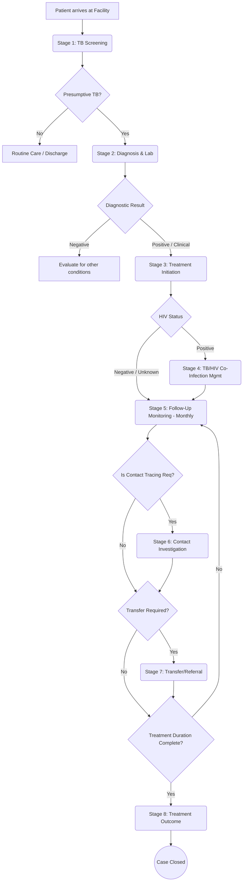

# TB Tracker Workflow

## 1. Patient Workflow Diagram

## 2. Key Workflow Roles
1. **Facility Data Clerk / Clinician**: Conducts screening, registers patients, initiates treatment, logs follow-ups and outcomes.
2. **Laboratory Officer**: Inputs GeneXpert, Smear, and Culture results into Stage 2 and Follow-up stages.
3. **County M&E Officer**: Monitors dashboards for missed appointments, data quality, and cohort reporting.
4. **National TB Program Officer**: Analyzes national treatment cascades, case detection rates, and TB/HIV co-infection statistics.
5. **System Administrator**: Manages metadata, user roles, facility assignments, and system maintenance.

## 3. Critical Alert Triggers
- **Overdue Diagnosis**: Presumptive case logged, but no diagnostic results within X days.
- **Delayed Treatment**: MTB+ detected, but no treatment start date logged within X days.
- **Defaulter Risk**: Missed follow-up appointment.
- **DR-TB Alert**: Rifampicin resistance detected (requires immediate DR-TB referral).
- **TB/HIV Action**: HIV+ patient not on ART or lacking recent viral load results.
